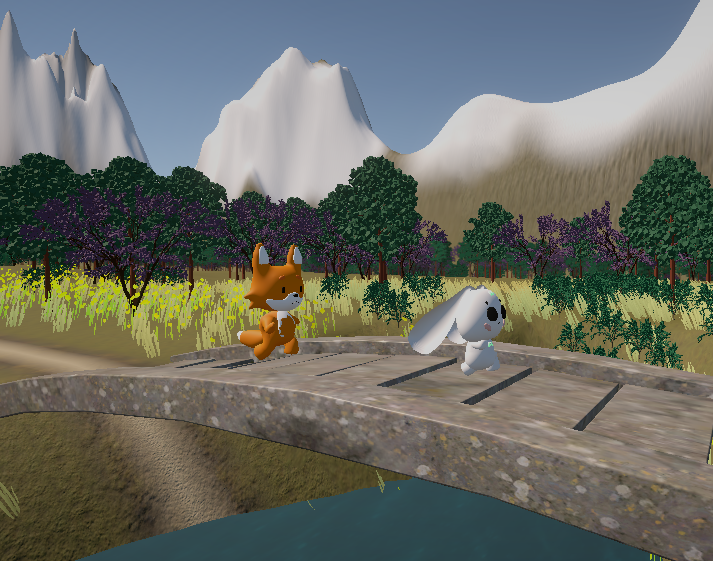
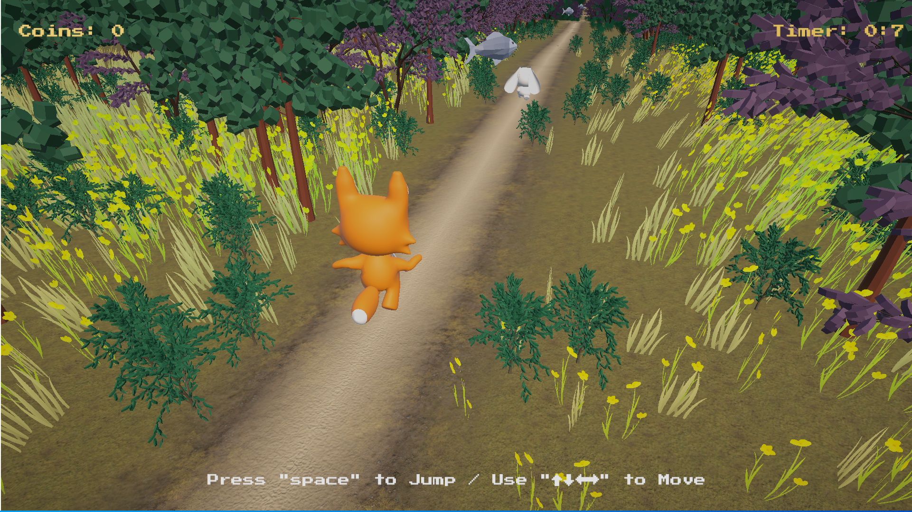

# Hunted and Hunter - Unity Game Project

## Team: Unity Pioneers

### Team Members:
- Sofya Murzakova
- Komola Benzinger
- Kerim Dincel

## Description:

**Target Audience:** The primary target audience for this game is children aged 4-12 years old.

**Game Concept:** Hunted and Hunter is a game where players can choose to be either a rabbit or a fox. As a rabbit, your goal is to run away from the fox, while as a fox, your objective is to catch the rabbit. Players must navigate through levels filled with obstacles such as stumps and stones and collect carrots (or fish) to gain speed boosts. The rabbit's ultimate aim is to reach the house at the end of the road (level), while the fox's goal is to catch the rabbit before it reaches the house.

**Development Stage:** This game is currently in prototype form with future development plans, including the addition of more levels, diverse environments, and complex game mechanics.

## Installation and Setup:

To play Hunted and Hunter, you will need the following:

1. **Unity Program:** Ensure you have the Unity development environment installed.

2. **Windows:** You can download the Windows version of the game from [here](https://drive.google.com/file/d/18zPQbcY5mCN40LgSNRAbj0WvQRBCQHb7/view?usp=drive_link).

3. **Mac:** You can download the Mac version of the game from [here](https://drive.google.com/file/d/12xbUpm-xAcYjSjKN5hjZzJumlCwMueXm/view?usp=sharing).

## Gameplay Instructions:

- **Controls:**
  - Key Forward: Run forward
  - Key Right: Turn right
  - Key Left: Turn left
  - Space: Jump

## Screenshots and Gameplay Videos:

## Features:

- Two-player roles: Rabbit and Fox
- Obstacle-filled levels
- Collectible carrots/fish for speed boosts
- Competitive gameplay with different goals for each role
