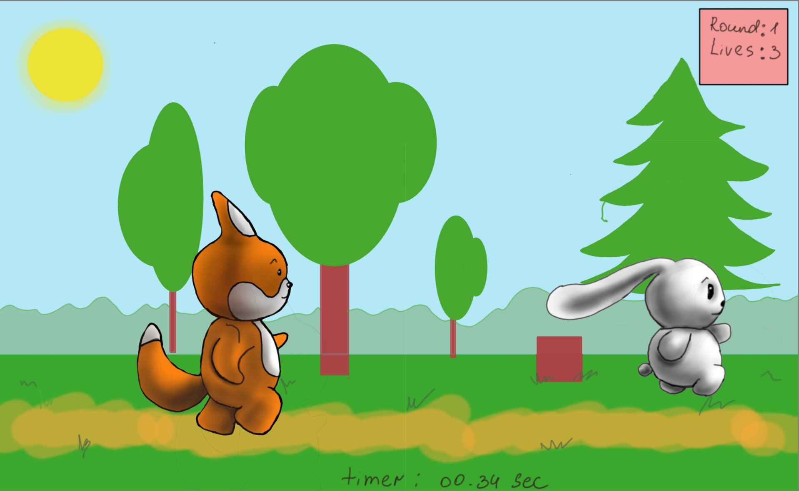

### Titel: Unity Pioneers

## Spielbeschreibung

**Spielname:** _Hunted and Hunter_

In Hunted and Hunter gibt es zwei Charaktere: einen Hasen und einen Fuchs. Einer der Charaktere muss den anderen einholen, um das Spiel zu gewinnen. Die Spieler können zwischen den beiden Charakteren wählen und beide Rollen ausprobieren. Das Spiel wird in 3D mit Third-Person-Ansicht und Seitwärtskamera-Blick umgesetzt.

Das Spielziel ist es, den anderen Charakter einzuholen. Das Spiel bietet verschiedene Power-Ups, die den Charakter schneller machen, das Tempo des Gegners reduzieren oder eine kurze Unverwundbarkeit gewähren. Jeder Charakter hat seine eigenen Stärken und Schwächen. Der Hase ist schnell, aber nicht sehr widerstandsfähig, während der Fuchs widerstandsfähiger ist, aber nicht so schnell wie der Hase.

Die Geschichte des Spiels ist einfach: Der Hase ist auf der Flucht vor dem Fuchs, der ihn jagt. Der Hase muss dem Fuchs entkommen, indem er so schnell wie möglich rennt. Der Fuchs hingegen muss den Hasen einholen, um ihn zu fangen.
Das Spiel basiert auf dem Kursthema "Skill". Die Spieler müssen ihre Geschicklichkeit und ihr Reaktionsvermögen verbessern, um den Gegner einzuholen oder zu entkommen.

Skizze des "Fuchs" -Protagonisten

Skizze des "Hasen" -Protagonisten

Skizze der Spielszene

## Technische Elemente

Das Spiel wird in 3D mit Third-Person-Ansicht und Seitwärtskamera-Blick umgesetzt. Der Artstyle des Spiels soll cartoonartig sein. Wir werden eigene Animationen erstellen und die Assets selbst erstellen oder kostenlose Assets aus dem Internet verwenden. Die Spiellogik wird mit einer geeigneten Spiele-Engine wie Unity  implementiert, 3D Modele werden mit 3D-Grafiksuite erstellt.

## ’Big Idea’

Die zentrale Idee von Hunted and Hunter ist, dass es ein Endless Runner-Spiel ist, bei dem es zwei Charaktere gibt, die sich auf der Flucht befinden oder jagen. Spieler können zwischen den beiden Rollen wählen und ihre Geschicklichkeit und ihr Reaktionsvermögen verbessern, um das Spiel zu gewinnen. Das Coolste an dem Spiel ist, dass es sehr einfach und schnell zu spielen ist, aber dennoch eine hohe Wiederspielbarkeit bietet. Das Spiel ist für alle Altersgruppen geeignet und kann sowohl allein als auch mit Freunden gespielt werden.

## Entwicklungszeitplan

1. **Funktionales Minimum (Layer 1)**

- _Ziel:_ Entwicklung einer minimalen Variante des Spiels, die aus einer minimalen Anzahl von Elementen besteht, damit es als Spiel bezeichnet werden kann.
- _Arbeitspakete:_ Ideenfindung für das Spielkonzept und die Elemente
- _Zeitplan:_ Wochen 1-2

1. **Minimalziel (Layer 2)**

- _Ziel:_ Erreichung des Minimalziels für das Spiel, das zufriedenstellend ist.
- _Arbeitspakete:_ Ausbau des Prototyps der minimalen Version des Spiels Erweiterung der Spielmechaniken
Verbesserung der Grafik und Audio
- _Zeitplan:_ Wochen 3-5

3. **Ziel (Layer 3)**

- _Ziel:_ Erreichen des Ziels, das Sie erreichen wollen, wenn alles gut läuft. Damit können Sie zufrieden sein.
- _Arbeitspakete:_ Implementierung zusätzlicher Spielmechaniken Verbesserung der Grafiken und des Audios
Fehlersuche und -behebung
- _Zeitplan:_ Wochen 6-9

4. **Wunschziel (Layer 4)**

- _Ziel:_ Erreichung des Wunschziels, das möglich ist, wenn alles wirklich gut läuft.
- _Arbeitspakete:_ Implementierung von Bonus-Features Verbesserung der Grafiken und des Audios auf höchstem Niveau Fehlersuche und -behebung
- _Zeitplan:_ Wochen 10-12

5. **Extras (Layer 5)**

- _Ziel:_ Entwicklung von Dingen, die nicht Teil des Hauptziels sind und die später in das Spiel integriert werden können.
- _Arbeitspakete:_ Brainstorming und Ideenfindung für zusätzliche Funktionen Entwicklung von Prototypen für zukünftige Updates
- _Zeitplan:_ Wochen 13-16

## Teamaufteilung

Da euer Team aus drei Mitgliedern besteht und jeder sich auf eine bestimmte Fähigkeit konzentriert, könntet ihr eure Rollen etwas anpassen, um sicherzustellen, dass jede Fähigkeit optimal genutzt wird. Ein möglicher Vorschlag könnte sein:

_Game Designer/Produzent:_ Dieses Teammitglied übernimmt die Verantwortung für die Konzeption des Spiels und die Überwachung des Projekts. Sie stellen sicher, dass das Team im Zeitplan bleibt und effektiv kommuniziert. Sie sind auch dafür verantwortlich, dass das Design des Spiels den Anforderungen der Gruppe entspricht.

_Programmierer/Qualitätssicherung:_ Dieses Teammitglied konzentriert sich auf die technische Umsetzung des Spiels, programmiert die Spielmechanik und -funktionen und testet das Spiel auf Fehler. Sie stellen sicher, dass das Spiel reibungslos läuft und eine gute Spielerfahrung bietet.

_Künstler/Designer:_ Dieses Teammitglied ist für die Erstellung von 3D-Modellen und Animationen verantwortlich und kümmert sich um den Artstyle des Spiels. Sie arbeiten eng mit dem Game Designer/Produzenten zusammen, um sicherzustellen, dass das Design des Spiels den Anforderungen der Gruppe entspricht.

Da jeder von euch auch ein Game Designer ist, könntet ihr bei der Konzeption und Gestaltung des Spiels zusammenarbeiten und eure Ideen einbringen. Zusammen könnt ihr dann entscheiden, welche Design-Fragen gelöst werden müssen und welche Entscheidungen für das Spiel getroffen werden sollten. Es ist jedoch wichtig, dass der Produzent ernst genommen wird und dass alle Teammitglieder eng zusammenarbeiten, um sicherzustellen, dass das Projekt im Zeitplan bleibt und ein erfolgreiches Ergebnis erzielt wird.