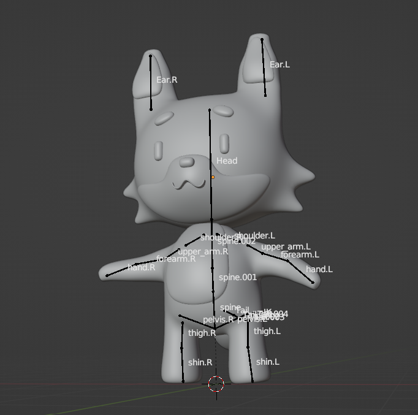

### Titel: Unity Pioneers

## Alpha Release

**Spielname:** _Hunted and Hunter_

**Spielidee:** 

In Hunted and Hunter gibt es zwei Charaktere: einen Hasen und einen Fuchs. Einer der Charaktere muss den anderen einholen, um das Spiel zu gewinnen. Die Spieler können zwischen den beiden Charakteren wählen und beide Rollen ausprobieren. 

Das Spielziel ist es, den anderen Charakter einzuholen. Das Spiel bietet verschiedene Power-Ups, die den Charakter schneller machen, das Tempo des Gegners reduzieren oder eine kurze Unverwundbarkeit gewähren. Jeder Charakter hat seine eigenen Stärken und Schwächen. Der Hase ist schnell, aber nicht sehr widerstandsfähig, während der Fuchs widerstandsfähiger ist, aber nicht so schnell wie der Hase.

Die Geschichte des Spiels ist einfach: Der Hase ist auf der Flucht vor dem Fuchs, der ihn jagt. Der Hase muss dem Fuchs entkommen, indem er so schnell wie möglich rennt. Der Fuchs hingegen muss den Hasen einholen, um ihn zu fangen.
Das Spiel basiert auf dem Kursthema "Skill". Die Spieler müssen ihre Geschicklichkeit und ihr Reaktionsvermögen verbessern, um den Gegner einzuholen oder zu entkommen.

Skizze des "Fuchs" -Protagonisten

Skizze des "Hasen" -Protagonisten

Skizze der Spielszene

## 3D Modellierung mit Blender
Das Design der Figuren erfolgt mithilfe des Programms Blender, mit der wir die beiden Charaktere Fuchs und Hase darsellen. 

**3D Model vom Fuchs:** 

 

**3D Test Model vom Hase:** 

Das Eingewöhnen in Blender erfolgte erstmal etwas schwerfällig mit allen zugrunde liegenden Funktionen und Tastenkombinationen, hatte man sich an diese aber angeeignet, ist es sehr angenehm zu nutzen, um Charaktere darzustellen die man sich vorstellt.
Dabei beginnt man mit geometrischen Körpern, die dann auf die gewünschten Körperteile angepasst werden. Dabei muss darauf geachtet werden, dass nicht zu sehr in Kleinigkeiten vertieft wird und viel Zeit verloren geht.

der Fuchs mit seinem Skelett für Animationen

Um die nötigen Animationen zu ermöglichen verbindet man seinen erstmals nur gezeichneten Charakter mit einem Skelett. Dabei passt man die Größe und zusätzliche Gliedern wie Schwanz und Ohren in unserem Fuchs Beispiel an. Um den Schwanz realistischer wirken zu lassen wurde ein zusätzliches Glied hinzugefügt und mit inverser Kinematik in Bezug mit dem vorherigen GLied gesetzt:

Problematisch war zu Beginn das Positionieren der Richtigen Knochen und Glieder mit dem designten Körper, wodurch manche Bewegungen überhaupt nicht einhergingen mit der gewünschten Bewegung des Körpers.

Indem man mit automatischen Gewichtungen das Skelett mit dem 3D Design verbindet ist man dann auch schon fertig und kann mit den Animationen beginnen. In unserem Falle benötigen wir die Standhaltung, das Laufen und das Springen des Körpers:

Laufen und Springen vom Fuchs

## Die Welt

Die Welt ist wie auch die Charaktere 3-dimensional eingegrenzt in einem rechteckigen Bereich, wo man auf Hindernisse stoßen kann und Münzen einsammeln kann. Sobald das Ziel erreicht wurde geht man auf das nächste Level weiter. Vorerst ist dies ein gerader Weg, kann aber mit bunteren Leveln, die weiter nach rechts und links gehen ausgeweitet werden.

Vorerst hat die Welt keine Löcher im Weg in die man hinein fallen kann, da der Spieler seine Bewegungsfreiheit verliert sobald er respawnt.

## Hunter und hunted

**Hauptmenü:**

**Auswahl der Charakteren:**

**Spielwelt:**

1. **Status**

    Bisher wurde der Bot Fuchs so eingestellt, dass dieser die Bewegungen des Spielers(Hase) versuchen soll nachzuahmen, ist aber nur dazu imstande gerade zu laufen und stehen zu bleiben.
    
    Die 3D Modelle sowie die Umgebung wurde noch nicht eingefügt.
    
    
2. **Ziel**   

    Einen Bot für den Hasen, sowie dem Fuchs zu erstellen, der eine gewisse Herausforderung bildet für den Spieler, um dem ganzen Spielen den Sinn zu geben.
    
    Power Ups, und/ oder Lebensanzeige in das Spiel integrieren
    
    buntere und mehr Level hinzufügen.

**Umgebung:**

## 
