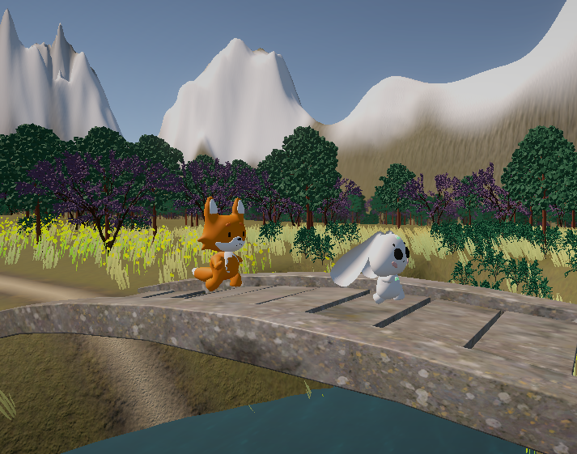

# Conclusion
#### _von Unity Pioneers Gruppe_

**Spielname:** _Hunted and Hunter_

### Bericht über die Entwicklung von "Hunted and Hunter" seit dem Alpha Release und Playtesting

Unser Projekt "Hunted and Hunter" hat seit dem Alpha-Release und dem Playtesting bedeutende Entwicklungen durchlaufen. Folgende Änderungen wurden vorgenommen:
1. Hinzufügen von Hindernissen (Steinen und Baumstümpfen), um die Schwierigkeit zu erhöhen.

2. Einleitung/Tutorial am Anfang des Spiels, um die Vorgeschichte zu erklären.

3. Anpassung der Geschwindigkeiten der Charaktere.
4. Verlängerung des Levelabschnitts.

Wir möchten in diesem Bericht auf unsere Erfahrungen im Kurs, die Umsetzung unserer Ideen, technische Herausforderungen und den allgemeinen Fortschritt eingehen.

##### a) Wie gut ließen sich ihre anfänglichen Ideen in das finale Spiel umsetzen? Konnten Sie ihren Zeitplan einhalten? 
Die Umsetzung unserer anfänglichen Ideen in das finale Spiel verlief größtenteils erfolgreich. Wir konnten die Hauptspielmechaniken wie das Verfolgen und Jagen zwischen Hasen und Fuchs gut integrieren. Die Charaktere und Power-Ups wurden erfolgreich implementiert, um das Spielerlebnis abwechslungsreich zu gestalten. Unser Zeitplan wurde im Großen und Ganzen eingehalten.

##### b) Wo sind sie stark davon abgewichen?
Wir sind leicht von unserem ursprünglichen Plan abgewichen, als wir beschlossen haben, das Spiel komplexer und dadurch interessanter zu gestalten. Nach Playtesting und Beratung mit den Professoren entschieden wir uns, Hindernisse ins Spiel einzubauen. Außerdem erweiterten wir das Level des Spiels, fügten ein kurzes Tutorial hinzu und verbesserten das Design.

##### c) Wie haben die Elemente des Kurses (Entwicklungsplan, Prototyp, Playtesting etc.) das Fortkommen im Kurs begünstigt oder behindert?
Die verschiedenen Elemente des Kurses, wie der Entwicklungsplan, das Prototyping und das Playtesting, waren äußerst hilfreich für den Fortschritt im Kurs. Der Entwicklungsplan half uns, die Aufgaben effizient zu organisieren und den Fortschritt im Auge zu behalten. Das Prototyping ermöglichte es uns, schnell Ideen zu testen und zu überprüfen, welche Mechaniken gut funktionieren. Das Playtesting lieferte uns wertvolles Feedback, das uns half, das Spiel zu verbessern und auf die Bedürfnisse der Spieler einzugehen.

##### d) Konnten Sie ihre Erwartungen umsetzen? Sind sie stolz auf das Spiel?
Wir sind mit der Erfüllung unserer Erwartungen zufrieden und stolz auf das erreichte Ergebnis. Das Spiel hat sich seit dem Alpha Release erheblich verbessert und bietet ein unterhaltsames und herausforderndes Spielerlebnis.

##### e) Hatten Sie genug Zeit?
Die zur Verfügung stehende Zeit war knapp bemessen und unsere Gruppe war klein (bestehend aus drei Personen), und wir mussten uns auf die wichtigsten Aspekte des Spiels konzentrieren. Obwohl wir unseren Zeitplan größtenteils einhalten konnten, hätten wir gerne noch mehr Zeit gehabt, um zusätzliche Features zu implementieren und das Spiel weiter zu polieren.

##### f) Was war die größte technische Schwierigkeit? 
Die größte technische Herausforderung bestand darin, eine effektive KI für den nicht vom Spieler gesteuerten Charakter zu erstellen. Wir haben verschiedene Ansätze ausprobiert und uns schließlich für die Richtungsvektor-Berechnung, Quaternion-Rotation und Raycasting entschieden, um die Bewegung und das Verhalten des Default-Fuchses/Hasen zu steuern.

##### g) Sind sie mit dem Thema des Kurses klar gekommen?
Wir kamen gut mit dem Thema des Kurses, "Skill", klar. Die Idee, ein Spiel zu entwickeln, das auf Geschicklichkeit und Reaktionsvermögen basiert, war eine spannende Herausforderung.

##### h) Hat Ihnen die Arbeit mit dem Thema Spaß gemacht, oder hätten Sie lieber mehr Freiheit gehabt?
Die Arbeit mit dem Kurskonzept hat uns viel Spaß gemacht, da es uns ermöglichte, ein unterhaltsames und herausforderndes Spiel zu entwickeln. Obwohl das Thema uns Einschränkungen auferlegte, empfanden wir die Herausforderung als positiv und anregend.

##### i) Was würden Sie bei ihrem nächsten Spiel anders machen?
Bei unserem nächsten Spiel planen wir mehr Zeit für das Feintuning und das Hinzufügen zusätzlicher Features ein. Um die Effizienz und Schnelligkeit der Entwicklung zu steigern, möchten wir unser Team erweitern, da es mit der begrenzten Teamaufstellung schwierig war, das Spiel und die komplexeren Funktionen umzusetzen.

##### j) Was war der größte Erfolg während des Projekts? War das Projekt ein Erfolg?  
Der größte Erfolg während des Projekts war die erfolgreiche Umsetzung der Verbesserungen basierend auf dem Playtesting-Feedback. Dies hat dazu geführt, dass unser Spiel ein noch besseres Spielerlebnis bietet. Wir betrachten das Projekt als Erfolg, da es uns gelungen ist, eine unterhaltsame und ansprechende Spielerfahrung zu schaffen. Allerdings könnten wir mit mehr Zeit und mehr Teammitgliedern zusätzliche Funktionen für das Spiel hinzufügen.

##### k) Mochten Sie Unity? 
Die Arbeit mit Unity war eine positive Erfahrung. Die Engine bietet eine Vielzahl von Tools und Ressourcen, die uns bei der Entwicklung unterstützt haben. Wir haben uns schnell in Unity eingearbeitet und waren beeindruckt von den Möglichkeiten, die es uns als Entwicklern bietet.

Abschließend möchten wir sagen, dass dieser Kurs uns wertvolle Erfahrungen im Bereich der Spieleentwicklung vermittelt hat. Wir sind stolz auf das, was wir erreicht haben, und freuen uns darauf, unser Projekt in Zukunft weiterzuentwickeln und zu verbessern. "Hunted and Hunter" hat uns gezeigt, dass die Spieleentwicklung eine aufregende und lohnende Herausforderung ist, die wir gerne weiterverfolgen werden.

##### Links:
- [Präsentation als pdf-Datei](./pdf/hunted_and_hunter_präsentation.pdf)
- [Download zip-Datei mit dem Spiel (hunted and hunter.exe)](https://drive.google.com/file/d/1jQIZowx4sy9y3R7-4QuCNZth34rjxJAW/view?usp=drive_link)
- Da das Problem mit dem Laden des Spiels über GitLab noch nicht vollständig gelöst wurde und das Paket mit unserem Terrain dort weiterhin fehlt, möchten wir eine alternative Lösung anbieten. Hier ist der  [Link zum Paket mit dem Terrain](https://drive.google.com/file/d/17ZkKAxJFPv2IbhqCL94uZVtq9yc_B4rv/view?usp=drive_link). Sie können dieses Paket herunterladen und verwenden, um das Spiel über GitLab zu öffnen und zu spielen. Wir entschuldigen uns für die Unannehmlichkeiten und hoffen, dass Ihnen diese alternative Methode weiterhilft.